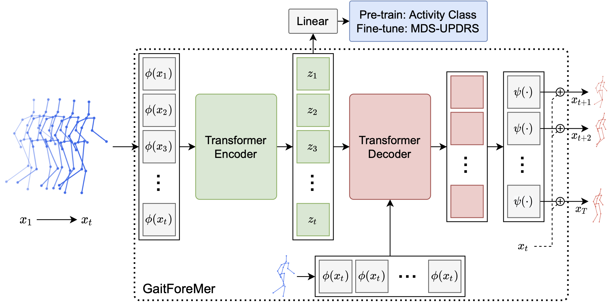

# GaitForeMer: Self-Supervised Pre-Training of Transformers via Human Motion Forecasting for Few-Shot Gait Impairment Severity Estimation

GaitForeMer (Gait Forecasting and impairment estimation transforMer) predicts MDS-UPDRS gait impairment severity scores using learned motion features from the pre-training task of human motion forecasting. This work will be presented in [MICCAI 2022](https://conferences.miccai.org/2022/) later this year!




## Requirements

* **Pytorch**>=1.7.
* **Numpy**.
* **Tensorboard** for pytorch.

## Pretext Task

The pre-trained weights are available for download [here](https://stanfordmedicine.box.com/s/d43piha9pos9xneisfgxln394tc81oyp).

If you would like, you can perform your own pre-training. In order to run your own pre-training, you will have to download the [**NTURGB+D**](https://rose1.ntu.edu.sg/dataset/actionRecognition/) dataset. Place ```nturgbd_skeletons_s001_to_s017.zip``` into the ```data/nturgb+d_data``` directory and unzip the file. You will then have to process the data by running ```python data/NTURGDDataset.py```. This will create all the needed files for pre-training the model. Once these steps have been completed, use the following script to do your own pre-training.

```
python training/transformer_model_fn.py \
  --task=pretext \
  --model_prefix=nturgb+d_out \
  --batch_size=16 \
  --data_path=data/nturgb+d_data \
  --learning_rate=0.0001 \
  --max_epochs=200 \
  --steps_per_epoch=200 \
  --loss_fn=l1 \
  --model_dim=128 \
  --num_encoder_layers=4 \
  --num_decoder_layers=4 \
  --num_heads=4 \
  --dim_ffn=2048 \
  --dropout=0.3 \
  --lr_step_size=400 \
  --learning_rate_fn=step \
  --warmup_epochs=100 \
  --pose_format=None \
  --pose_embedding_type=gcn_enc \
  --dataset=ntu_rgbd \
  --pre_normalization \
  --pad_decoder_inputs \
  --non_autoregressive \
  --pos_enc_alpha=10 \
  --pos_enc_beta=500 \
  --predict_activity \
  --action=all \
  --source_seq_len=40 \
  --target_seq_len=20
```


## Downstream Task

Once you have pre-trained weights, you can run the downstream task of gait impairment severity estimation.

### Data
The PD dataset used in the paper is not publically available, but the [CASIA Gait Database](http://www.cbsr.ia.ac.cn/english/Gait%20Databases.asp) is available upon request. [This repo](https://github.com/mlu355/PD-Motor-Severity-Estimation) has the steps for extracting poses and preprocessing the data. We follow this setup in our work.

### Training and Evaluating

To train and evaluate GaitForeMer, run this command:

```
python3 training/transformer_model_fn.py \
  --downstream_strategy=both_then_class \
  --model_prefix=output_models/finetune_both_branches_then_class_branch \
  --batch_size=16 \
  --data_path=<PATH_TO_PD_DATA> \
  --learning_rate=0.0001 \
  --max_epochs=100 \
  --steps_per_epoch=200 \
  --loss_fn=l1 \
  --model_dim=128 \
  --num_encoder_layers=4 \
  --num_decoder_layers=4 \
  --num_heads=4 \
  --dim_ffn=2048 \
  --dropout=0.3 \
  --lr_step_size=400 \
  --learning_rate_fn=step \
  --warmup_epochs=10 \
  --pose_format=None \
  --pose_embedding_type=gcn_enc \
  --dataset=pd_gait \
  --pad_decoder_inputs \
  --non_autoregressive \
  --pos_enc_alpha=10 \
  --pos_enc_beta=500 \
  --predict_activity \
  --action=all \
  --source_seq_len=40 \
  --target_seq_len=20 \
  --finetuning_ckpt=<PATH_TO_PRETRAINED_MODEL_CHECKPOINT e.g. pre-trained_ntu_ckpt_epoch_0099>
```

You can change the fine-tuning strategy by alterning the ```downstream_strategy``` parameter.
